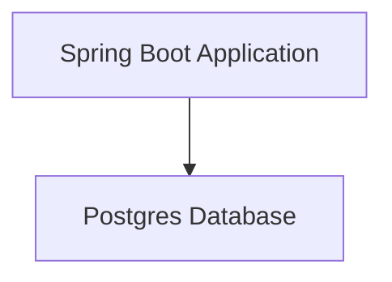
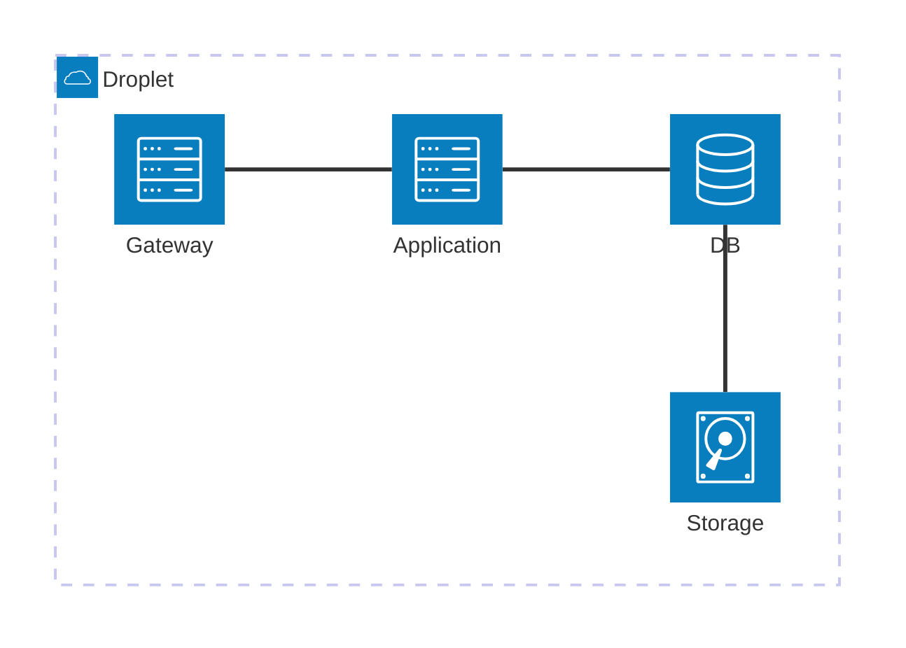

This guide demonstrates how to deploy a standard Spring Boot application using deploy4j.

We'll cover the prerequisites, build and deployment steps, and testing procedures.

There is a sample [deploy4j demo repository](https://github.com/teggr/deploy4j-demo) that can be used as a reference implementation.

We'll be deploying a simple Spring Boot application that connects to a Postgres database.



## Prerequisites

- `deploy4j` installed (see [installation guide]({{ '/installation' | relative_url }}))
- Working Spring Boot application codebase that can be [built into a Docker image](https://fabric8io.github.io/docker-maven-plugin/#build-configuration).
- A built Docker image that can optionally be pushed to a Docker registry. Make a note of the image name and tag.
- A ready server with Digital Ocean, Hetzner, or similar provider (see [server provisioning guide]({{ '/guides/server-provisioning' | relative_url }})). Ensure you have SSH access to the server. You can also test using a local [droplet clone](https://github.com/teggr/deploy4j-docker-droplet).

For this tutorial, we are using a Digital Ocean droplet with the following configuration:

* LON1 region
* Ubuntu 25.10 OS
* Basic type
* $6/mo CPU (1 vCPU, 1GB RAM, 25GB)
* SSH key authentication

This configuration can be applied using either the Digital Ocean web console or CLI tools.

```shell
doctl compute droplet create \
    --image ubuntu-25-10-x64 \
    --size s-1vcpu-1gb \
    --region lon1 \
    --vpc-uuid **** \
    ubuntu-s-1vcpu-1gb-lon1-01
```

We get assigned `138.68.182.132` for our droplet. We can now SSH into the server to verify connectivity.

```shell
ssh root@138.68.182.132
```

Note: Doing this at least once will ensure that the server's SSH fingerprint is added to your known hosts file.

## Initialisation

Start by initialising the deploy4j configuration in your project. This will create a `config/deploy.yml` file and a `.deploy4j/secrets` in the root directory.

```shell
deploy4j init
```

The initialised `config/deploy.yml` can then be edited to suit your application requirements. We are going to configure the file for our Spring Boot application.

```yaml
# The service name
service: deploy4j-demo
# The Docker image name
image: teggr/deploy4j-demo
# List of servers we want to deploy our application to
servers:
  - 138.68.182.132
# Registry configuration for pulling the Docker image.
# We are using Docker Hub in this case.
# The username and password will be pulled from the .deploy4j/secrets file.
registry:
  username:
    - DOCKER_USERNAME
  password:
    - DOCKER_PASSWORD
# Environment variables for the Spring Boot application.
# We are configuring the database connection here.
# Datasource URL points to the Postgres accessory on the same host.
env:
  clear:
    SPRING_DATASOURCE_URL: jdbc:postgresql://138.68.182.132:5432/testdb
    SPRING_DATASOURCE_USERNAME: testuser
    SPRING_DATASOURCE_PASSWORD: testpass
# SSH configuration for connecting to the server.
# We are using key based authentication.
# The private key and passphrase will be pulled from the .deploy4j/secrets file.
ssh:
  key_path:
    - PRIVATE_KEY
  key_passphrase:
    - PRIVATE_KEY_PASSPHRASE
  known_hosts_path:
    - KNOWN_HOSTS_PATH
# Accessories configuration for the Postgres database.
accessories:
  db:
    image: postgres:18-alpine
    host: 138.68.182.132
    port: 5432
    env:
      clear:
        POSTGRES_USER: testuser
        POSTGRES_PASSWORD: testpass
        POSTGRES_DB: testdb
    directories:
      - data:/var/lib/postgresql/18/docker
# Gateway configuration for load balancing and routing.
# We are enabling the dashboard for monitoring.
gateway:
  publish: true
  args:
    api.dashboard: true
    api.insecure: true
  options:
    publish: "8080:8080"
```

As noted in the configuration, we need to setup some secrets in the `.deploy4j/secrets` file. Create a `.deploy4j/secrets` file in the root of the project with the following contents:

```text
DOCKER_PASSWORD=*****
DOCKER_USERNAME=*****
PRIVATE_KEY=<<path to your private key>>
PRIVATE_KEY_PASSPHRASE=*****
KNOWN_HOSTS_PATH=<<path to your known host file>>
```

We are now ready to deploy our Spring Boot application!

## Deployment

The first time we deploy with deploy4j, we need to run the `setup` command. This will bootstrap the server, install Docker, setup Gateway, create the Postgres accessory, and deploy the application.

```shell
deploy4j setup --version 0.0.2-SNAPSHOT

Acquiring the deploy lock...
Ensure Docker is installed...
Missing Docker on 138.68.182.132. Installing...
Boot accessories...
Log into image registry...
Pull app image...
Ensure Gateway is running...
Detect stale containers...
Get most recent version available as an image...
Start container with version 0.0.2-SNAPSHOT using a nulls readiness delay (or reboot if already running)...
Container is healthy
First web container is healthy on 138.68.182.132, booting any other roles
Prune old containers and images...
Releasing the deploy lock...
=================================
Finished all in  in 66 seconds

```

Now we can visit our Spring Boot application:

* Running application in the browser at `http://138.68.182.132/`
* Gateway dashboard at `http://138.68.182.132:8080/dashboard/#/`



## Review

Now that the application is deployed, we can review the deployment using various deploy4j commands.

We can use `deploy4j details` to see the running containers on the server.

```shell
deploy4j details

CONTAINER ID   IMAGE           COMMAND                  CREATED          STATUS          PORTS                                                                              NAMES
60746d132cae   gateway:v2.11   "/entrypoint.sh --pr…"   37 minutes ago   Up 37 minutes   0.0.0.0:80->80/tcp, [::]:80->80/tcp, 0.0.0.0:8080->8080/tcp, [::]:8080->8080/tcp   gateway

CONTAINER ID   IMAGE                                COMMAND                  CREATED          STATUS          PORTS      NAMES
7437bfeb9019   teggr/deploy4j-demo:0.0.2-SNAPSHOT   "java -jar /app/app.…"   27 minutes ago   Up 27 minutes   8080/tcp   deploy4j-demo-web-0.0.2-SNAPSHOT

CONTAINER ID   IMAGE                COMMAND                  CREATED          STATUS          PORTS                                         NAMES
9fcbbd2ac92e   postgres:18-alpine   "docker-entrypoint.s…"   37 minutes ago   Up 37 minutes   0.0.0.0:5432->5432/tcp, [::]:5432->5432/tcp   deploy4j-demo-db
```

We can view the app logs using `deploy4j app logs`.

```shell
deploy4j app logs

2025-11-08T10:02:16.456817906Z 
2025-11-08T10:02:16.457096557Z   .   ____          _            __ _ _
2025-11-08T10:02:16.457105454Z  /\\ / ___'_ __ _ _(_)_ __  __ _ \ \ \ \
2025-11-08T10:02:16.457108142Z ( ( )\___ | '_ | '_| | '_ \/ _` | \ \ \ \
2025-11-08T10:02:16.457110534Z  \\/  ___)| |_)| | | | | || (_| |  ) ) ) )
2025-11-08T10:02:16.457112659Z   '  |____| .__|_| |_|_| |_\__, | / / / /
2025-11-08T10:02:16.457114813Z  =========|_|==============|___/=/_/_/_/
2025-11-08T10:02:16.457117261Z 
2025-11-08T10:02:16.459808902Z  :: Spring Boot ::                (v3.5.7)
2025-11-08T10:02:16.460015735Z 
2025-11-08T10:02:16.746724702Z 2025-11-08T10:02:16.740Z  INFO 1 --- [deploy4j-demo] [           main] d.d.jdemo.Deploy4jDemoApplication        : Starting Deploy4jDemoApplication v0.0.2-SNAPSHOT using Java 24.0.2 with PID 1 (/app/app.jar started by root in /)
...
2025-11-08T10:02:28.450424932Z 2025-11-08T10:02:28.450Z  INFO 1 --- [deploy4j-demo] [           main] liquibase.lockservice                    : Successfully released change log lock
2025-11-08T10:02:28.455829735Z 2025-11-08T10:02:28.454Z  INFO 1 --- [deploy4j-demo] [           main] liquibase.command                        : Command execution complete
2025-11-08T10:02:32.433790133Z 2025-11-08T10:02:32.432Z  INFO 1 --- [deploy4j-demo] [           main] o.s.b.w.embedded.tomcat.TomcatWebServer  : Tomcat started on port 8080 (http) with context path '/'
2025-11-08T10:02:32.513261762Z 2025-11-08T10:02:32.511Z  INFO 1 --- [deploy4j-demo] [           main] d.d.jdemo.Deploy4jDemoApplication        : Started Deploy4jDemoApplication in 17.921 seconds (process running for 20.742)
2025-11-08T10:03:00.721365167Z 2025-11-08T10:03:00.720Z  INFO 1 --- [deploy4j-demo] [nio-8080-exec-1] o.a.c.c.C.[Tomcat].[localhost].[/]       : Initializing Spring DispatcherServlet 'dispatcherServlet'
2025-11-08T10:03:00.723828625Z 2025-11-08T10:03:00.721Z  INFO 1 --- [deploy4j-demo] [nio-8080-exec-1] o.s.web.servlet.DispatcherServlet        : Initializing Servlet 'dispatcherServlet'
2025-11-08T10:03:00.726937918Z 2025-11-08T10:03:00.726Z  INFO 1 --- [deploy4j-demo] [nio-8080-exec-1] o.s.web.servlet.DispatcherServlet        : Completed initialization in 2 ms
```

Deploy4j also maintains an audit log of all deployments. We can view this using `deploy4j audit`.

```shell
deploy4j audit

[2025-11-08T09:51:49.2596283Z] Pushed env files
[2025-11-08T09:51:51.4973715Z] Booted db accessory
[2025-11-08T09:52:00.9176809Z] Pulled image with version 0.0.2-SNAPSHOT
[2025-11-08T09:52:16.7819702Z] Booted app version 0.0.2-SNAPSHOT
[2025-11-08T09:52:17.8790963Z] Tagging teggr/deploy4j-demo:0.0.2-SNAPSHOT as the latest image
[2025-11-08T09:52:18.2035488Z] Pruned containers
[2025-11-08T09:52:18.6692753Z] Pruned images
```
